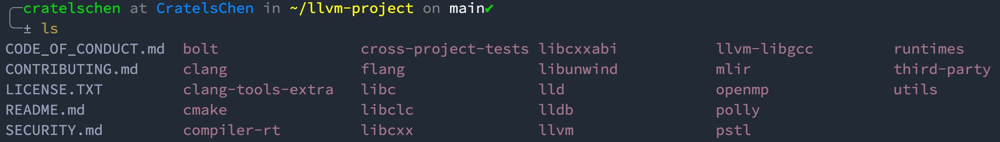

# 目录简介
## llvm-project/bolt
BOLT (Binary Optimization and Layout Tool)
作用与二进制文件的优化与布局工具，暂不研究。

## llvm-project/clang
Clang是一个基于llvm上的编译器前端，支持编译的高级语言有C/C++/Objective-C等，它拥有惊人的快速编译代码的能力（如，在Debug下编译Objective-C"比GCC快大约3倍"）。

Clang为用户提供更加友好和清晰有用的报错/警告信息，同时提供了一个用于构建出色的源代码级工具的平台。例如，将Clang作为库构建的工具——Clang静态分析器，它是一种可自动查找代码bug的工具。

## llvm-project/clang-tools-extra
clang-tools-extra作为LLVM和Clang基础架构项目的一部分。这些工具独立开来，以便于更加轻便地checkout Clang的核心代码。
如果要将该项目添加到LLVM中构建时，需要将其添加到llvm/tools目录中，并命名为extra。

## llvm-project/compiler-rt
compiler-rt 项目提供了底层代码生成器支持例程的高度优化实现，例如：当目标没有简短的本机指令序列来实现核心IR操作时，会生成"__fixunsdfdi"和其它调用。它还为动态测试工具提供了运行时库的实现，例如AdressSanitizer, ThreadSanitizer, MemorySanitizer, 和 DataFlowSanitizer。关于Sanitizer的详解，可以查看我之前写的博客：https://blog.csdn.net/weixin_46222091/article/details/104375875
编译器的运行时支持

## llvm-project/cross-project-tests
测试用例

## llvm-project/flang
使用 modern C++编写的成长中的 Fortran 前端。

## llvm-project/libc
LLVM 实现的 C 标准库

## llvm-project/libclc
libclc项目旨在实现OpenCL标准库。

## llvm-project/libcxx & llvm-project/libcxxabi
libc++和libc++ ABI项目提供了标准一致的和高性能的C++标准库实现，包括C++ 11和C++ 14。

## llvm-project/libunwind
libunwind是HP libunwind项目定义的接口的实现。 它由Apple贡献，是一种使clang++移植到没有系统展开器的平台的方法。 它旨在作为ABI的一种小型且快速的实施方案，而忽略一些HP中libunwind用得少的某些功能（例如，远程展开）。
## llvm-project/lld
LLD项目是一个新的链接器，这是系统链接程序的直接替代，并且运行速度更快。

## llvm-project/lldb
LLDB项目建立在LLVM和Clang提供的库的基础上，以提供出色的本机调试器。
它使用Clang AST和表达式解析器，LLVM JIT，LLVM反汇编程序等，从而提供了更好的使用体验。 在加载符号时，它也比GDB速度更快，存储效率更高。

## llvm-project/llvm
## llvm-project/llvm-libgcc
## llvm-project/mlir
Multi-Level Intermediate Representation
多级中间表示系统

## llvm-project/openmp
OpenMP子项目提供一个OpenMP运行时。

## llvm-project/polly
polly项目实现了一套缓存局部性优化以及自动并行化和向量化功能。

## llvm-project/pstl
并行STL是C ++标准库算法的实现，支持ISO/IEC 14882:2017标准（通常称为C ++ 17）中指定的执行策略。 该实现还支持Parallelism TS版本2中指定的无序执行策略，并在C ++工作组论文P1001中为下一版本的C ++标准提出了建议。
并行STL为算法的并行和矢量化执行提供有效的支持。 对于顺序执行，它依赖于C ++标准库的可用实现。

## llvm-project/runtimes
## llvm-project/third-party
## llvm-project/utils

## llvm-project/llvm
该目录及其子目录包含LLVM的源代码，LLVM是用于构建高度优化的编译器，优化器和运行时环境的工具包。
LLVM是开源软件。 您可以根据LICENSE.txt中的许可协议条款自由分发。
请参阅docs目录中提供的文档以获取有关LLVM的进一步帮助，尤其是docs/GettingStarted.rst以了解LLVM的入门知识，以及docs/README.txt以获得LLVM的文档设置概述。
llvm directory layout
llvm-project/llvm目录包括如下内容：

### llvm-project/llvm/benchmarks/
基准测试，它支持为函数注册基准测试。
### llvm-project/llvm/bindings/
该目录包含LLVM编译器基础结构的绑定，以允许使用非C或C++语言编写的程序可以利用LLVM基础结构，例如：自托管（self-hosted）的编译器前端。
### llvm-project/llvm/cmake/
该目录包含用于构建LLVM的cmake-project文件。

### llvm-project/llvm/configure
LLVM项目不再支持使用configure＆make进行构建。请迁移到基于CMake的构建系统。
### llvm-project/llvm/CREDITS.TXT
该文件是对LLVM项目做出贡献的人员的部分列表。 如果您已为LLVM贡献了补丁或做出了其他贡献，请向该文件提交补丁以添加您自己，即可完成！
### llvm-project/llvm/docs/
LLVM项目的文档。
### llvm-project/llvm/examples/
使用LLVM IR和JIT的简单示例。
### llvm-project/llvm/include/
从LLVM库导出的公共头文件。 三个主要子目录：
* llvm/include/llvm/，所有LLVM特定的头文件，以及LLVM的不同部分的子目录：Analysis，CodeGen，Target，Transforms等。
* llvm/include/llvm/Support/，LLVM附带的通用支持库，但不一定特定于LLVM。 例如，某些C ++ STL实用程序和命令行选项处理库在此处存储头文件。
* llvm/include/llvm/Config/，由cmake配置的头文件。 它们包装“标准” UNIX和C头文件。 源代码可以包括这些头文件，这些头文件会自动处理cmake生成的条件#include。
### llvm-project/llvm/lib/
大多数源文件在这里。 通过将代码放入库中，LLVM使得在工具之间共享代码变得容易。
* llvm/lib/IR/，实现诸如Instruction和BasicBlock之类的核心类的核心LLVM源文件。
* llvm/lib/AsmParser/，LLVM汇编语言解析器库的源代码
* llvm/lib/Bitcode/，用于读取和写入LLVM bitcode的代码。
* llvm/lib/Analysis/，各种程序分析，例如调用图，归纳变量，自然循环标识等。
* llvm/lib/Transforms/，IR到IR程序的转换，例如积极的死代码消除，稀疏条件常量传播，内联，循环不变代码运动，死全局消除等。
* llvm/lib/Target/，描述用于代码生成的目标体系架构（ISA）的文件。 例如，llvm/lib/Target/X86保存X86计算机的描述。
* llvm/lib/CodeGen/，代码生成器的主要部分：指令选择器，指令调度和寄存器分配。
* llvm/lib/MC/，该目录的代码主要是处理机器码（Machine Code），以及处理生成ELF格式的obj文件的代码。
* llvm/lib/ExecutionEngine/，用于在运行时直接执行LLVM bitcode的库。
* llvm/lib/Support/，该目录存放与llvm/include/ADT/和llvm/include/Support/中的头文件相对应的源代码。
llvm-project/llvm/LLVMBuild.txt
该文件是当前目录中组件的LLVMBuild描述文件。有关LLVMBuild系统的更多信息，请参见。
llvm-project/llvm/llvm.spec.in
特殊的LLVM项目配置文件。
llvm-project/llvm/projects/
项目并非严格属于LLVM，而是与LLVM一起提供。 这也是用于创建您自己的基于LLVM的项目的目录。
llvm-project/llvm/README.txt
介绍和说明LLVM项目的文本文件。
llvm-project/llvm/RELEASE_TESTERS.TXT
该文件是负责确保在发布过程中测试和验证目标和环境的人员的列表。
llvm-project/llvm/runtimes/
运行时是LLVM的子项目。 它们与工具或其他嵌入式项目不同，因为应使用Build目录中的LLVM工具链来构建运行时。
llvm-project/llvm/test/
LLVM基础架构上的功能和回归测试以及其他完整性检查。 它们旨在快速运行并覆盖很多领域，而并非详尽无遗
llvm-project/llvm/tools/
该目录下包含了基于LLVM基础架构的重要工具。通过构建项目可以产生工具的可执行文件，您始终可以通过输入TOOL_NAME -help获得有关工具的帮助。 以下列举几个常用的工具：
* bugpoint
* llvm-ar
* llvm-as
* llvm-dis
* llvm-link
* lli
* llc
* opt
关于这些工具的详解，参见
llvm-project/llvm/unittests/
使用Google test和Google Mock编写的单元测试。
llvm-project/llvm/utils/
用于处理LLVM源代码的实用程序； 有些是构建过程的一部分，因为它们是基础结构部分的代码生成器。
* codegen-diff，查找LLC生成的代码与LLI生成的代码之间的差异。 如果您要调试其中一个，并且假定另一个生成正确的输出，这将很有用。 对于完整的用户手册，请运行：perldoc codegen-diff。
* emacs，LLVM汇编文件和TableGen描述文件的Emacs和XEmacs语法突出显示。 有关使用它们的信息，请参见自述文件。
* getsrcs.sh，查找并输出所有未生成的源文件，如果希望跨目录进行大量开发并且不想查找每个文件，则很有用。一种使用它的方法是运行，例如：从LLVM源代码树的顶部开始utils/getsources.sh。
* llvmgrep，在LLVM中的每个源文件上执行egrep -H -n，并将llvmgrep命令行中提供的正则表达式传递给它。 这是在源文件库中搜索特定正则表达式的有效方法。
* TableGen，包含TableGen工具的所有代码文件，TableGen用于从通用TableGen描述文件生成寄存器描述、指令集描述。
* vim/，LLVM汇编文件和TableGen描述文件的Vim语法突出显示。 请参阅README文件以了解如何使用它们。
*
